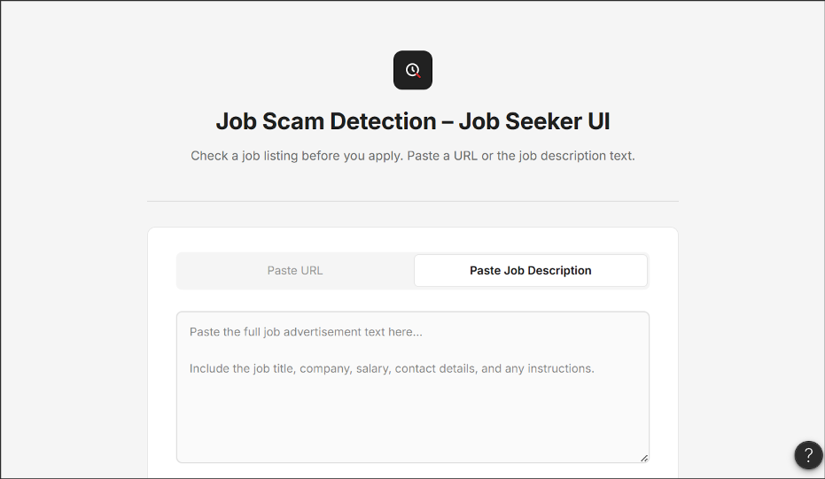
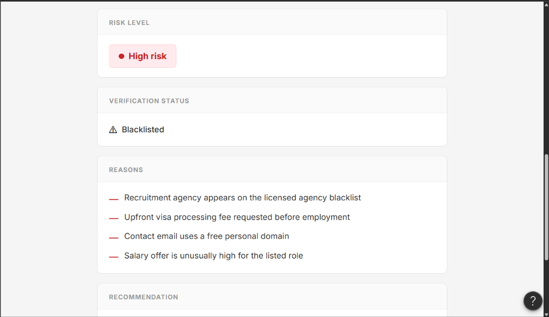
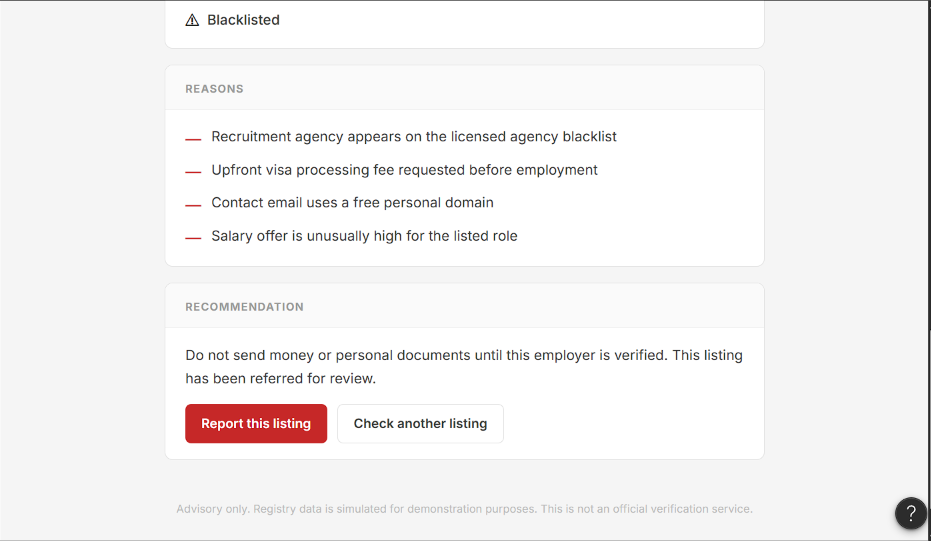
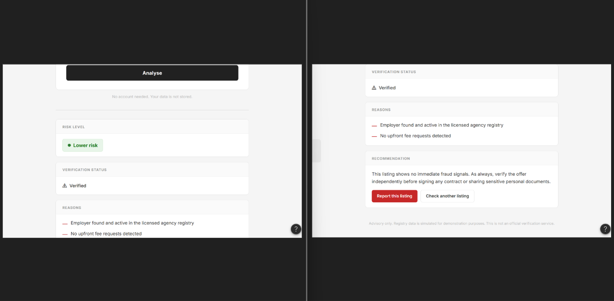
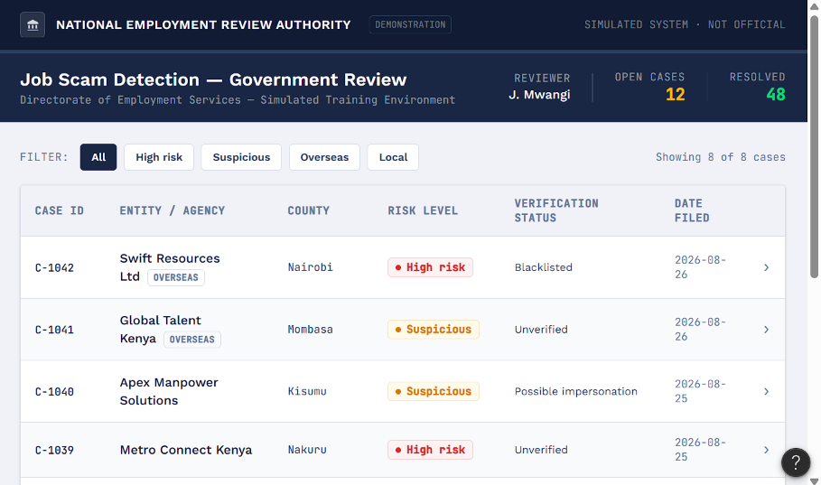
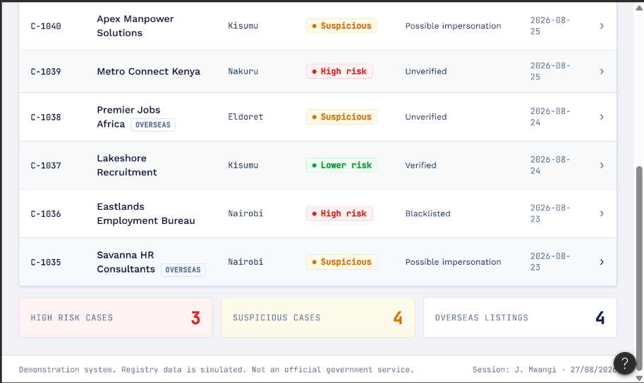
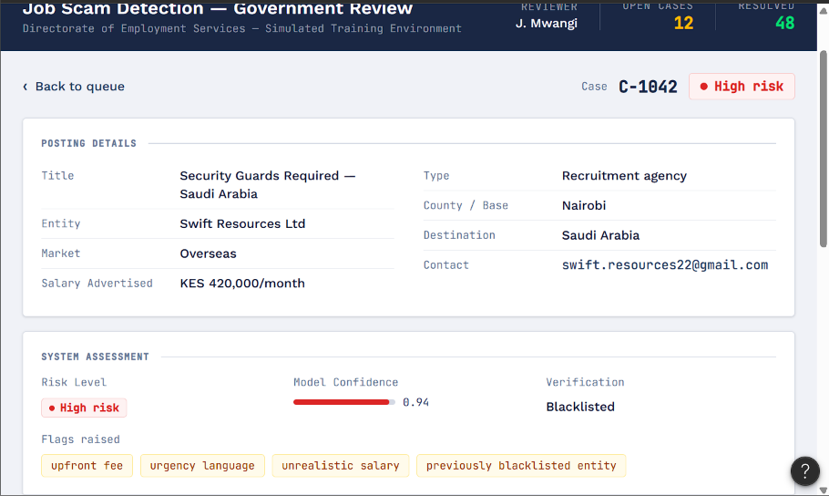
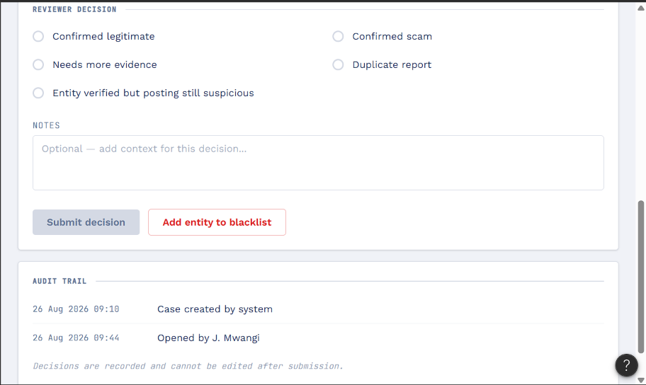

# Interface Designs

Wireframes for the two interfaces in the system. These are design prototypes, not the built application. They exist to show the intended user flow, the information each user group receives, and the design decisions behind both.

The system has two distinct users with different needs, so it has two distinct interfaces. A job seeker needs an advisory result they can act on immediately. A government reviewer needs case context, a decision workflow, and an audit trail.

---

## The core design decision

Every result screen reports **two independent statuses** rather than one combined verdict.

| Risk assessment | Verification status |
| --- | --- |
| `Lower risk` | `Verified` |
| `Suspicious` | `Unverified` |
| `High risk` | `Blacklisted` |
| | `Possible impersonation` |
| | `Not applicable` |

**Risk** comes from the posting content: the language, the fee requests, the salary, the contact details.

**Verification** comes from checking the named employer or agency against registry data.

These are kept separate because collapsing them would be misleading in both directions:

- Not found in a registry does not mean fraudulent. Many legitimate small employers will be absent from an incomplete registry.
- Found in a registry does not mean safe. A scammer can impersonate a registered company.
- Blacklisted is strong high risk evidence.
- A close but inexact name match is a possible impersonation, not a match.

The word "safe" is never used. The system reports lower risk, never guaranteed safety.

---

## Job Seeker Interface

The public facing tool. No account required, and submitted data is not stored.

### Input



The user submits a listing either as a URL or as pasted job description text. Pasted text is the primary path because it always works, including for listings shared on social media or WhatsApp where there is no clean URL to extract from. If URL extraction fails, the interface falls back to asking for pasted text. Extraction failure is never treated as evidence of fraud.

### High risk result



A blacklisted recruitment agency advertising overseas work. The risk badge and the verification status are shown as separate blocks, followed by the specific reasons that produced the result.

The reasons are the point. A score alone tells a job seeker nothing they can act on. Naming the upfront visa fee, the personal email domain, and the unrealistic salary lets the user recognise the same pattern elsewhere, even without the tool.



The recommendation states plainly what not to do, and confirms the listing has been referred for review. That referral is what connects the job seeker path to the government path.

### Lower risk result



An employer found in the company registry with no fee requests detected. The recommendation still advises independent verification before signing a contract or sharing personal documents, because a clean automated result is not a guarantee.

Note the registry cited here is the **company registry**, not the agency registry. A direct employer advertising its own vacancy is not operating as a recruitment agency and must not be penalised for being absent from an agency register. The system decides which registry applies based on whether the posting comes from a direct employer or an intermediary.

---

## Government Review Interface

A separate internal tool for reviewers. It is deliberately a different application from the job seeker interface, since reviewer tooling should never be exposed to the public.

All branding, registry data, and case records shown are simulated for demonstration.

### Review queue



Cases arrive here automatically when a posting is scored suspicious or high risk, when an entity cannot be verified, when a name closely resembles a registered entity without matching it, or when system components disagree.

The queue is sortable and filterable by risk level and by local against overseas market. Overseas listings are tagged, because those carry the highest potential harm.



Summary tiles give a reviewer an immediate sense of workload and of where the current concentration of risk sits.

### Case detail



The full case: the posting as submitted, the system assessment with the model confidence made explicit, and the specific flags raised. Showing the confidence value rather than hiding it lets a reviewer weigh the machine judgement rather than simply defer to it.



The reviewer resolves the case with one of five outcomes, including "needs more evidence" and "entity verified but posting still suspicious." Real cases are not always cleanly legitimate or fraudulent, and forcing a binary decision would produce bad labels.

The notes field captures reasoning. The audit trail records who did what and when, and decisions cannot be edited after submission.

Reviewed outcomes feed a versioned retraining pool. They are **not** fed back into the model automatically. A reviewer clicking a button is not a training event.

---

## Full flow

```
Job seeker submits a listing
            |
            v
    Content extraction
            |
   +--------+--------+
   |        |        |
   v        v        v
  NLP     Rules   Registry
  risk   signals  lookup
   |        |        |
   +--------+--------+
            |
            v
     Decision layer
  risk + verification + reasons
            |
     +------+------+
     v             v
Job seeker    Government
  result      review queue
                   |
                   v
            Reviewer decision
                   |
                   v
        Audit trail + retraining pool
```

---

## Missing from this set

The **Suspicious / Unverified** job seeker state is not yet captured. It is the most important case for the project's argument: a listing whose content reads plausibly, but whose named agency cannot be found. The user still receives a warning and the case is still referred for review, demonstrating that an unverified entity is handled as caution rather than as an accusation.

---

*Prototypes produced with Figma Make. Registry data, case records, and institutional branding are simulated. This is a student capstone project and not an official verification service.*
